# Laporan Proyek Machine Learning - Muhammad Rizano Lukman

## Domain Proyek

Penyakit kardiovaskular (CVD) adalah salah satu penyebab utama kematian di seluruh dunia. Menurut World Health Organization (WHO), sekitar 17.9 juta orang meninggal setiap tahunnya akibat penyakit kardiovaskular, yang merupakan 32% dari semua kematian global (WHO, 2019). Deteksi dini dan manajemen risiko CVD sangat penting untuk mengurangi angka kematian dan meningkatkan kualitas hidup.

Mendeteksi risiko penyakit kardiovaskular pada tahap awal dapat memberikan kesempatan untuk intervensi dini, yang dapat mengurangi risiko komplikasi serius atau kematian. Dengan menggunakan Machine Learning, kita dapat mengembangkan model prediktif yang dapat membantu dokter dan pasien dalam pengambilan keputusan.

Tujuan utama dari proyek ini adalah untuk membangun model prediktif yang dapat mengidentifikasi individu yang berisiko tinggi terkena CHD dalam 10 tahun ke depan. Hasil dari prediksi ini nantinya dapat digunakan untuk menginformasikan langkah-langkah pencegahan yang tepat, seperti perubahan gaya hidup, pengobatan, dan pemantauan rutin.

Referensi :

[Artikel Cardiovascular diseases (CVDs) dari WHO](https://www.who.int/news-room/fact-sheets/detail/cardiovascular-diseases-(cvds)?gad_source=1&gclid=Cj0KCQjwtsy1BhD7ARIsAHOi4xacMZtnhIRzeIwci9lzRCKyq1Cji2rbY_nyvOEwmn30CpqXuJMm05gaAi2CEALw_wcB)


## Business Understanding

### Problem Statements

Masalah yang diangkat dalam proyek ini berkaitan dengan prediksi risiko penyakit jantung koroner (CHD) dalam jangka waktu 10 tahun menggunakan data dari Framingham Heart Study. Penyakit jantung koroner adalah salah satu penyebab utama kematian dan pengenalan dini risiko individu dapat menyelamatkan nyawa dan meningkatkan kualitas hidup. Untuk mencapai hal ini, beberapa pernyataan masalah yang harus dipecahkan adalah sebagai berikut:

- **Pernyataan Masalah 1**: <br>
  Bagaimana memprediksi risiko 10 tahun terkena CHD berdasarkan data demografis dan klinis pasien?

- **Pernyataan Masalah 2**: <br>
  Apa saja fitur-fitur utama yang paling signifikan dalam mempengaruhi risiko CHD?


### Goals

Tujuan dari proyek ini adalah untuk memberikan jawaban yang konkret untuk setiap pernyataan masalah yang telah disebutkan di atas:

- **Jawaban Pernyataan Masalah 1**:<br>
  Mengembangkan model prediksi yang dapat memperkirakan risiko 10 tahun terkena CHD dengan akurasi yang tinggi menggunakan data yang tersedia.

- **Jawaban Pernyataan Masalah 2**:<br>
  Melakukan analisis fitur untuk mengidentifikasi faktor-faktor utama yang berkontribusi terhadap risiko CHD, seperti tekanan darah, kadar kolesterol, kebiasaan merokok, dan lain-lain.


### Solution statements
- **Solusi Goals 1**:<br> 
  Pengembangan model deteksi risiko terkena CHD akan menggunakan tiga algoritma machine learning yaitu Random Forest, Logistic Regression dan K-Nearest Neighbor. Dari ketiga model akan dipilih satu model dengan performa terbaik. Metrik evaluasi yang akan digunakan pada adalah accuracy, precision, recall dan F1 Score.
- **Solusi Goals 2**:<br>
  Melakukan analisis korelasi untuk melakukan analisis fitur untuk mengidentifikasi faktor-faktor utama yang berkontribusi terhadap risiko CHD. Hasil dari analisis korelasi akan dilakukan visualisasi untuk mempermudah mencerna informasi.

## Data Understanding
Dataset ini berasal dari studi kardiovaskular yang sedang berlangsung terhadap penduduk kota Framingham, Massachusetts. Dataset ini mencakup lebih dari 4238 data dan 16 atribut. 

Sumber: [Kaggle](https://www.kaggle.com/datasets/dileep070/heart-disease-prediction-using-logistic-regression).

### Variabel-variabel pada dataset adalah sebagai berikut:
1. **male**: Merupakan jenis kelamin partisipan (1 = Laki-laki, 0 = Perempuan).
2. **age**: Usia partisipan.
3. **education**: Tingkat pendidikan partisipan (1 = Tanpa Pendidikan, 2 = Sekolah Dasar, 3 = Sekolah Menengah, 4 = Perguruan Tinggi).
4. **currentSmoker**: Status merokok saat ini (1 = Ya, 0 = Tidak).
5. **cigsPerDay**: Jumlah rokok yang dihisap per hari oleh partisipan yang merokok.
6. **BPMeds**: Penggunaan obat tekanan darah (1 = Menggunakan, 0 = Tidak Menggunakan).
7. **prevalentStroke**: Riwayat stroke (1 = Pernah, 0 = Tidak Pernah).
8. **prevalentHyp**: Riwayat hipertensi (1 = Pernah, 0 = Tidak Pernah).
9. **diabetes**: Status diabetes (1 = Mengidap Diabetes, 0 = Tidak Mengidap Diabetes).
10. **totChol**: Total kolesterol partisipan (mg/dL).
11. **sysBP**: Tekanan darah sistolik (mmHg).
12. **diaBP**: Tekanan darah diastolik (mmHg).
13. **BMI**: Indeks massa tubuh (kg/m²).
14. **heartRate**: Detak jantung per menit.
15. **glucose**: Tingkat glukosa dalam darah (mg/dL).
16. **TenYearCHD**: Risiko terkena penyakit jantung koroner dalam 10 tahun (1 = Risiko, 0 = Tidak Risiko).

Semua variabel diatas bertipe numerik dan variabel TenYearCHD sebagai target.
### Proses EDA
Berikut adalah sampel dari beberapa data menggunakan ```df.head()```
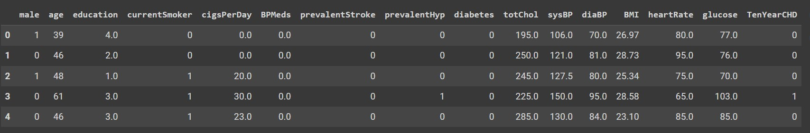

Berikut adalah info dari dataset menggunakan ```df.info()```
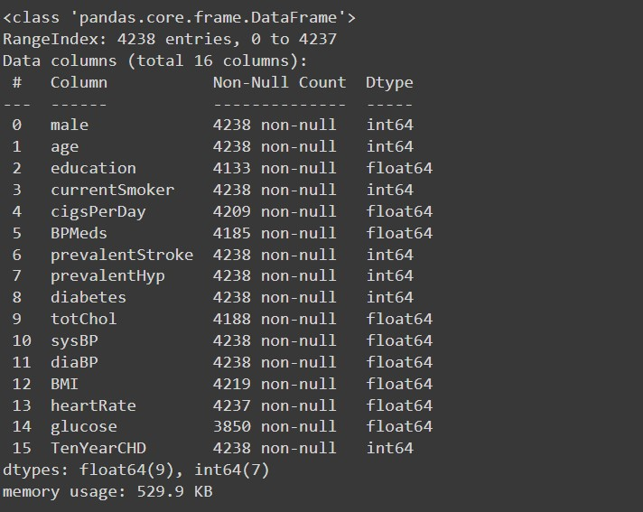

Terlihat pada informasi diatas bahwa semua atribut memiliki tipe numerik. Selain itu, terdapat missing value di beberapa atribut.

Berikut adalah informasi berapa jumlah variabel yang terdapat missing value menggunakan ```df.isnull().sum()```
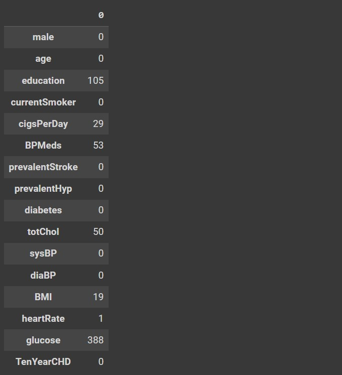

Terlihat bahwa atribut ''glucose'' memiliki missing value terbanyak berjumlah 388.

Berikut adalah statistik deskriptif pada dataset menggunakan ```df.describe()```
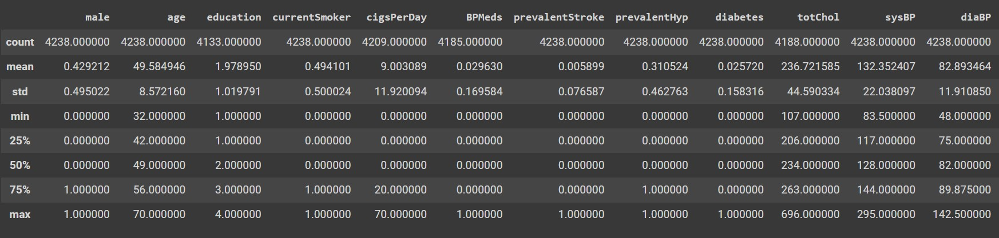
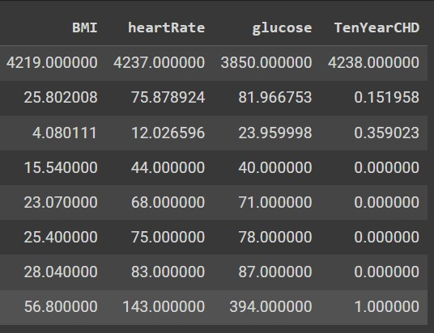

Berikut adalah jumlah data yang mengandung outlier pada setiap feature
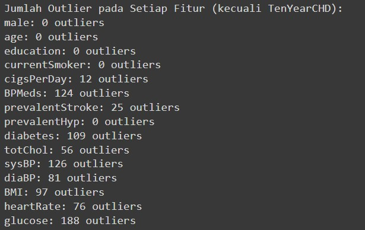
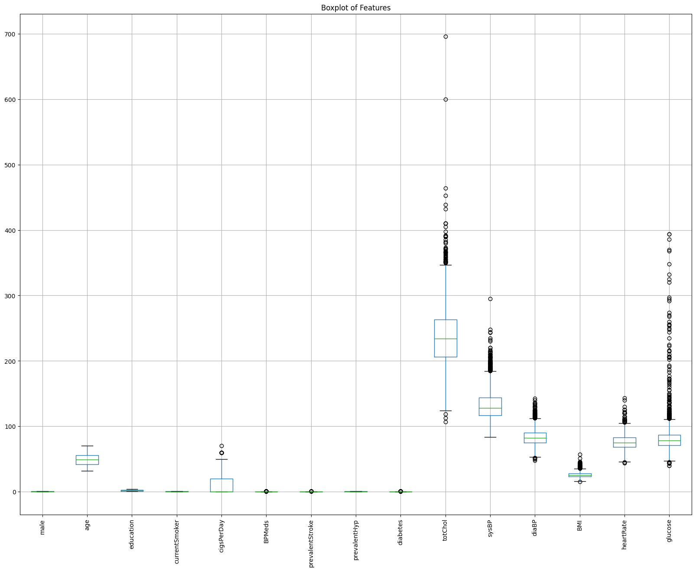

Berikut adalah jumlah target dari masing-masing kelas

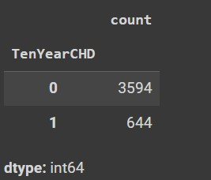

Terlihat bawa dataset memiliki imbalance class karena class 0 lebih banyak daripada class 1.

Selanjutnya, akan dilakukan analisis korelasi. Berikut adalah plot analisis korelasi dari setiap atribut 
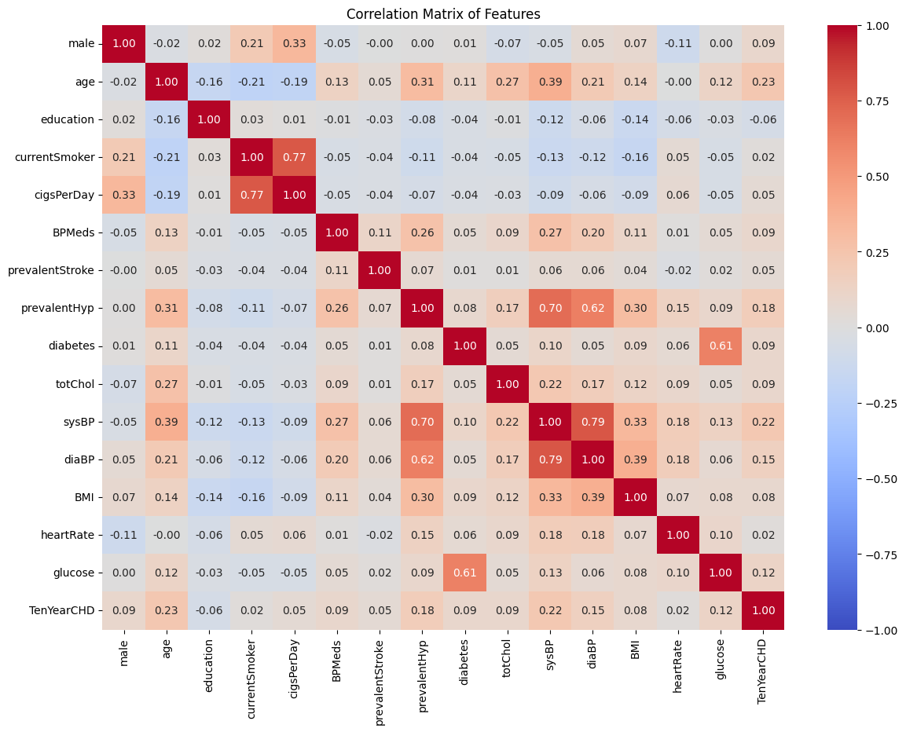

Dari plot korelasi diatas menunjukkan bahwa umur, Tekanan darah sistolik (sysBP) dan Riwayat hipertensi (prevalentHyp) memiliki korelasi yang kuat jika dibandingkan dengan fitur lain terhadap target (TenYearCHD). Umur, tekanan darah sistolik, dan riwayat hipertensi dapat dianggap sebagai faktor risiko utama untuk penyakit jantung koroner. Individu dengan karakteristik ini harus dianggap memiliki risiko yang lebih tinggi dan mungkin memerlukan pemantauan dan intervensi yang lebih ketat untuk mencegah penyakit jantung.

Sedangkan, tingkat pendidikan (education) memiliki korelasi yang paling lemah terhadap target. Ini mengindikasikan bahwa penyakit CHD ini tidak memandang bulu terkait pendidikan penderitanya. Semua orang punya resiko untuk terkena penyakit ini tidak memandang apa strata pendidikannya.

## Data Preparation
Berikut adalah tahapan data preparation yang dilakukan:

1. **Penanganan Missing Value**<br>
 Saya melakukan pengisian value menggunakan median yang terdapat missing value didalamnya menggunakan ```df.fillna(df.median(), inplace=True)```. Alasan melakukan itu karena median adalah termasuk central tendecy yang tidak sensitif terhadap outlier, tidak seperti mean yang sensitif terhadap outlier. Berikut adalah info dataset setelah dilakukan proses pengisian missing values menggunakan median
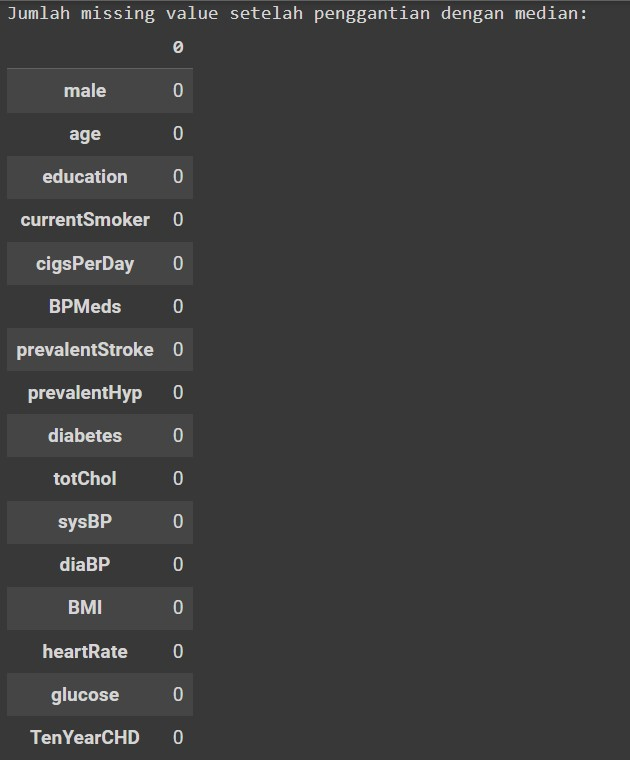

Terlihat bahwa fitur sudah tidak memiliki missing value.

2. **Melakukan Feature Selection**<br>
 Saya melakukan Feature Selection dengan cara melakukan drop terhadap fitur-fitur yang memiliki coeficient korelasi kurang dari 0.05 terhadap target. Hal ini dilakukan untuk mengurangi kompleksitas model dan meningkatkan performa dengan hanya mempertahankan fitur yang berpengaruh signifikan terhadap target. Berikut adalah info dataset setelah dilakukan Feature Selection:
 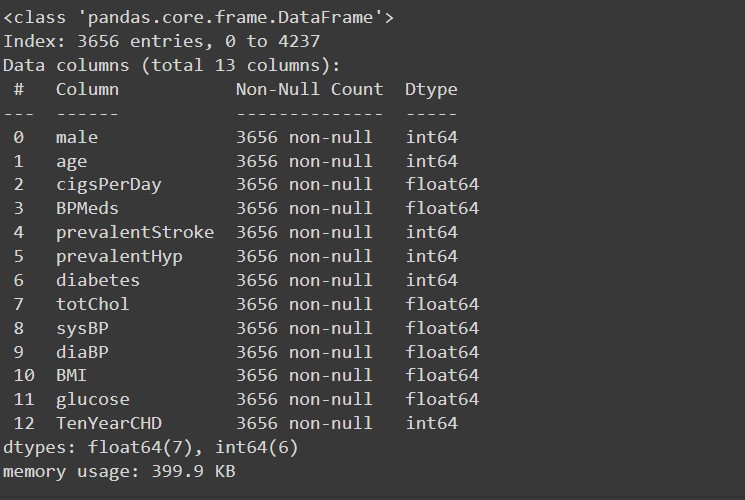

3. **Melakukan Upsampling pada Kelas Minoritas**<br>
  saya melakukan upsampling pada dataset untuk mengatasi masalah imbalance pada data. Saya melakukan upsampling pada kelas minoritas (kelas 1) agar jumlah data pada kelas minoritas sama dengan jumlah kelas pada kelas mayoritas (kelas 0). Hal ini dilakukan agar tidak terjadi imbalance class pada dataset yang bisa menyebabkan model machine learning menjadi bias terhadap kelas mayoritas, sehingga performa model dalam memprediksi kelas minoritas menjadi buruk. Berikut adalah jumlah data pada setiap kelas setelah dilakukan upsampling:

  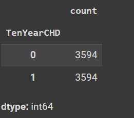

4. **Melakukan Train-Test Split**<br>
  saya melakukan train-test split pada dataset dengan proporsi 80% untuk data train dan 20% untuk data test. Saya juga memisahkan antara kolom fitur dan kolom label. Pembagian ini dilakukan untuk mengevaluasi model yang dibangun menggunakan data train dan menguji performa model tersebut pada data yang belum pernah dilihat sebelumnya (data test).

5. **Melakukan Standarisasi**<br>
  Saya melakukan standarisasi terhadap fitur. Ini dilakukan untuk memastikan semua fitur berada dalam skala yang sama sehingga membuat fitur menjadi bentuk yang lebih mudah diolah oleh algoritma machine learning. Proses ```fit``` standarisasi dilakukan hanya pada data training saja untuk mencegah data leakage. Setelah itu, proses ```transform``` standarisasi dilakukan pada data training dan data test. berikut adalah gambaran code <br> 
  ```scaler = StandardScaler()```<br>
  ```x_train = scaler.fit_transform(x_train)```<br>
   ```x_test = scaler.transform(x_test)```


## Modeling
Pada tahap ini, saya akan menggunakan tiga algoritma Machine Learning untuk membangun model prediksi risiko penyakit jantung koroner (CHD) dalam 10 tahun. Algoritma yang digunakan adalah Random Forest, Logistic Regression, dan K-Nearest Neighbor.

1. **Random Forest**  
   Kelebihan:
   - Mampu menangani data dengan jumlah fitur yang besar.
   - Robust terhadap overfitting karena menggunakan metode ensemble dari banyak pohon keputusan.
   - Dapat menangani data yang tidak distandarisasi.
   
   Kekurangan:
   - Interpretasi hasil model lebih sulit dibandingkan dengan model linear.
   - Membutuhkan lebih banyak sumber daya komputasi dan waktu pelatihan.
   
   Parameter yang digunakan:
   - n_estimators: Jumlah pohon dalam hutan.<br> Saya menggunakan `n_estimators=100` untuk memastikan model memiliki cukup banyak pohon untuk mengurangi variansi dan meningkatkan akurasi prediksi.
   - max_depth: Kedalaman maksimum dari pohon keputusan. <br>
   Saya menggunakan `max_depth=10` untuk mengontrol kompleksitas pohon dan mencegah overfitting.
   - random_state: Penentu seed acak untuk memastikan hasil yang konsisten. <br>
   Saya menggunakan `random_state=42` untuk memastikan hasil yang dapat direproduksi.

   Cara kerja:
   Random Forest bekerja dengan membangun banyak pohon keputusan selama pelatihan dan mengeluarkan kelas yang merupakan mode dari kelas-kelas (klasifikasi) atau rata-rata prediksi (regresi) dari masing-masing pohon individu. Setiap pohon dibangun dari sampel acak dari data pelatihan, dan fitur-fitur terbaik dipilih berdasarkan pengurangan impuritas.

2. **Logistic Regression**  
   Kelebihan:
   - Mudah diimplementasikan dan cepat dalam pelatihan.
   - Hasil model mudah diinterpretasi.
   - Memberikan probabilitas prediksi yang membantu dalam analisis lebih lanjut.
   
   Kekurangan:
   - Kinerja mungkin kurang baik pada data yang tidak linear.
   - Sensitif terhadap multicollinearity antara fitur-fitur.
   
   Parameter yang digunakan:
   - penalty: Jenis regularisasi (L1, L2).<br>
    Saya menggunakan `penalty='l2'` untuk menambahkan regularisasi Ridge yang dapat membantu mencegah overfitting.
   - C: Inverse dari kekuatan regularisasi.<br> Saya menggunakan `C=1.0` yang merupakan nilai default, memberikan keseimbangan antara kompleksitas model dan regularisasi.
   - random_state: Penentu seed acak untuk memastikan hasil yang konsisten. <br>
   Saya menggunakan `random_state=42` untuk memastikan hasil yang dapat direproduksi.

   Cara kerja:
   Logistic Regression menggunakan fungsi logistik untuk memodelkan probabilitas kejadian kelas tertentu. Model ini menghitung bobot untuk setiap fitur, yang dioptimalkan dengan meminimalkan fungsi kerugian log-loss. Regularisasi dapat diterapkan untuk mencegah overfitting.

3. **K-Nearest Neighbor (K-NN)**  
   Kelebihan:
   - Mudah diimplementasikan dan intuitif.
   - Tidak memerlukan asumsi distribusi data.
   - Kinerja yang baik pada dataset kecil.
   
   Kekurangan:
   - Kinerja menurun pada dataset besar karena membutuhkan banyak memori dan waktu komputasi.
   - Sensitif terhadap skala data dan outliers.
   
   Parameter yang digunakan:
   - n_neighbors: Jumlah tetangga terdekat yang digunakan untuk prediksi.<br>Saya menggunakan `n_neighbors=5` sebagai jumlah tetangga default, yang umumnya memberikan hasil yang baik pada berbagai dataset.
   - weights: Metode penimbangan tetangga (uniform, distance). <br>
   Saya menggunakan `weights='uniform'` yang berarti semua tetangga memiliki bobot yang sama dalam prediksi.

   Cara kerja:
   K-NN bekerja dengan mencari 'k' contoh data terdekat dalam ruang fitur dan membuat keputusan berdasarkan mayoritas kelas (untuk klasifikasi) atau rata-rata (untuk regresi) dari tetangga-tetangga tersebut. Jarak biasanya diukur menggunakan metrik Euclidean.

Setelah melakukan data preparation, saya membuat ketiga model di atas menggunakan library Scikit-learn. Ketiga model ditraining menggunakan data training `x_train` sebagai fitur dan `y_train` sebagai target. Setelah melakukan proses training, model akan dievaluasi menggunakan data testing. Model akan memprediksi `x_test` sebagai fitur dan menghasilkan prediksi `y_prediction`. `y_prediction` inilah yang akan dievaluasi dengan `y_test` untuk menentukan performa masing-masing model.

Dari hasil percobaan menggunakan ketiga model di atas, dihasilkan model dengan performa terbaik adalah **Random Forest**. Model ini mengungguli model Logistic Regression dan K-Nearest Neighbor pada metrik accuracy, precision, recall, dan F1 Score. Untuk lebih lanjut terkait hasil percobaan, dapat dilihat pada ***Evaluation***.


## Evaluation

### Metrik Evaluasi yang Digunakan

Dalam proyek ini, saya menggunakan beberapa metrik evaluasi untuk menilai kinerja model Machine Learning yang dibangun. Metrik yang digunakan meliputi:

1. **Accuracy**:<br> 
   Accuracy mengukur proporsi prediksi yang benar dari total prediksi yang dibuat oleh model. Ini adalah metrik yang sederhana dan intuitif, yang menunjukkan seberapa sering model membuat prediksi yang benar. Accuracy dihitung dengan membagi jumlah prediksi yang benar (baik positif maupun negatif) dengan total jumlah prediksi. Meskipun accuracy memberikan gambaran umum tentang kinerja model, ia tidak mempertimbangkan distribusi kelas dalam dataset. Dalam konteks dataset yang tidak seimbang, accuracy bisa menyesatkan karena model bisa saja memprediksi mayoritas kelas dengan benar tetapi gagal dalam memprediksi kelas minoritas.
   - **Formula**: <br> 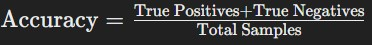
   - **Kelebihan**: Mudah dipahami dan diimplementasikan.
   - **Kekurangan**: Tidak cocok untuk dataset yang tidak seimbang karena tidak mempertimbangkan distribusi kelas.

2. **Precision**:<br> 
   Precision mengukur proporsi prediksi positif yang benar dari keseluruhan prediksi positif yang dibuat oleh model. Ini menunjukkan seberapa baik model dalam menghindari prediksi positif palsu. Precision sangat penting ketika biaya dari prediksi positif palsu tinggi, misalnya dalam diagnosa medis dimana false positives bisa menyebabkan perawatan yang tidak perlu. Precision dihitung dengan membagi jumlah prediksi positif yang benar dengan total jumlah prediksi positif (baik benar maupun salah).
   - **Formula**: <br> 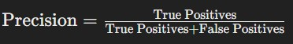
   - **Kelebihan**: Penting ketika biaya dari prediksi positif palsu tinggi.
   - **Kekurangan**: Tidak memperhitungkan prediksi negatif yang salah.

3. **Recall**: <br>
   Recall mengukur proporsi sampel positif yang sebenarnya yang terdeteksi dengan benar oleh model. Ini menunjukkan seberapa baik model dalam mengidentifikasi semua sampel positif. Recall sangat penting ketika biaya dari prediksi negatif palsu tinggi, misalnya dalam deteksi penyakit dimana false negatives bisa menyebabkan kegagalan dalam pengobatan. Recall dihitung dengan membagi jumlah prediksi positif yang benar dengan total jumlah sampel positif yang sebenarnya.
   - **Formula**: <br> 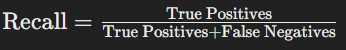
   - **Kelebihan**: Penting ketika biaya dari prediksi negatif palsu tinggi.
   - **Kekurangan**: Tidak memperhitungkan prediksi positif yang salah.

4. **F1 Score**: <br>
   F1 Score adalah rata-rata harmonis dari precision dan recall, yang memberikan keseimbangan antara keduanya. Ini adalah metrik yang berguna ketika kita ingin mempertimbangkan keduanya secara bersamaan. F1 Score penting ketika kita perlu keseimbangan antara precision dan recall, terutama dalam kasus di mana kita memiliki dataset yang tidak seimbang. Nilai F1 Score tinggi hanya ketika kedua nilai precision dan recall tinggi, membuatnya metrik yang lebih dapat diandalkan dalam situasi tersebut.
   - **Formula**: <br> 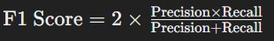
   - **Kelebihan**: Memberikan keseimbangan antara precision dan recall.
   - **Kekurangan**: Tidak seintuitif accuracy dan lebih sulit diinterpretasikan.

### Hasil Proyek Berdasarkan Metrik Evaluasi

Berikut adalah hasil evaluasi dari ketiga model yang digunakan:

1. **Random Forest**:
   - **Accuracy**: 0.85
   - **Precision**: 0.91 (kelas 0) dan 0.80 (kelas 1)
   - **Recall**: 0.79 (kelas 0) dan 0.91 (kelas 1)
   - **F1 Score**: 0.85 (kelas 0) dan 0.85 (kelas 1)
   - **Macro Avg**: Precision 0.86, Recall 0.85 sehingga F1 Score 0.85
   - **Weighted Avg**: Precision 0.86, Recall 0.85 sehingga F1 Score 0.85

2. **Logistic Regression**:
   - **Accuracy**: 0.66
   - **Precision**: 0.69 (kelas 0) dan 0.64 (kelas 1)
   - **Recall**: 0.65 (kelas 0) dan 0.68 (kelas 1)
   - **F1 Score**: 0.67 (kelas 0) dan 0.66 (kelas 1)
   - **Macro Avg**: Precision 0.66, Recall 0.66 sehingga F1 Score 0.66
   - **Weighted Avg**: Precision 0.67, Recall 0.66 sehingga F1 Score 0.66

3. **K-Nearest Neighbor (K-NN)**:
   - **Accuracy**: 0.78
   - **Precision**: 0.89 (kelas 0) dan 0.71 (kelas 1)
   - **Recall**: 0.66 (kelas 0) dan 0.91 (kelas 1)
   - **F1 Score**: 0.76 (kelas 0) dan 0.80 (kelas 1)
   - **Macro Avg**: Precision 0.80, Recall 0.78 sehingga F1 Score 0.78
   - **Weighted Avg**: Precision 0.80, Recall 0.78 sehingga F1 Score 0.78

### Penjelasan Hasil Proyek

1. **Accuracy**:
   - Berdasarkan hasil evaluasi terbaru, Random Forest menunjukkan akurasi tertinggi yaitu 0.85, diikuti oleh K-Nearest Neighbor (K-NN) dengan 0.78, dan Logistic Regression dengan 0.66. Meskipun Random Forest memiliki akurasi tertinggi, akurasi saja tidak cukup untuk mengevaluasi kinerja model secara keseluruhan, terutama dalam konteks dataset yang mungkin tidak seimbang.

2. **Precision**:
   - Precision untuk kelas 0 cukup tinggi di semua model, menunjukkan bahwa prediksi negatif palsu sangat sedikit. Random Forest memiliki precision yang sangat baik baik untuk kelas 0 (0.91) maupun kelas 1 (0.80). K-NN juga menunjukkan precision yang cukup baik dengan nilai 0.89 untuk kelas 0 dan 0.71 untuk kelas 1. Logistic Regression menunjukkan precision yang lebih rendah dibandingkan dua model lainnya, dengan nilai 0.69 untuk kelas 0 dan 0.64 untuk kelas 1. Precision yang lebih rendah pada Logistic Regression menunjukkan lebih banyak prediksi positif palsu dibandingkan model lainnya.

3. **Recall**:
   - Random Forest memiliki recall yang baik untuk kedua kelas (0.79 untuk kelas 0 dan 0.91 untuk kelas 1), menunjukkan bahwa model ini mampu mendeteksi sebagian besar sampel positif dan negatif. K-NN juga menunjukkan recall yang baik untuk kelas 1 (0.91), tetapi lebih rendah untuk kelas 0 (0.66). Logistic Regression memiliki recall yang lebih seimbang antara kelas 0 (0.65) dan kelas 1 (0.68), meskipun nilainya lebih rendah dibandingkan dengan Random Forest.

4. **F1 Score**:
   - F1 Score, yang merupakan keseimbangan antara precision dan recall, menunjukkan bahwa Random Forest memiliki performa yang paling seimbang dengan nilai 0.85 untuk kedua kelas. K-NN mengikuti dengan nilai F1 Score sebesar 0.76 untuk kelas 0 dan 0.80 untuk kelas 1. Logistic Regression memiliki F1 Score yang lebih rendah dengan nilai 0.67 untuk kelas 0 dan 0.66 untuk kelas 1, yang menunjukkan bahwa model ini kurang efektif dibandingkan dengan dua model lainnya.

5. **Macro Avg dan Weighted Avg**:
   - **Macro avg** memberikan rata-rata yang seimbang untuk setiap metrik tanpa memperhatikan jumlah sampel di setiap kelas. Random Forest memiliki nilai macro avg yang paling tinggi dengan precision 0.86, recall 0.85, dan F1 Score 0.85. K-NN memiliki nilai macro avg yang cukup baik dengan precision 0.80, recall 0.78, dan F1 Score 0.78, sementara Logistic Regression memiliki nilai macro avg yang paling rendah.
   - **Weighted avg** memperhitungkan jumlah sampel di setiap kelas, dan dalam semua model, weighted avg menunjukkan nilai yang sedikit lebih tinggi dari macro avg, karena didominasi oleh performa yang baik di kelas mayoritas (kelas 0). Random Forest tetap menjadi model dengan performa terbaik di sini, dengan nilai weighted avg yang sama dengan macro avg.

### Kesimpulan

Berdasarkan metrik evaluasi, **Random Forest** terbukti menjadi model terbaik dalam mendeteksi kedua kelas, baik positif maupun negatif, dengan performa yang seimbang. Model ini tidak hanya menunjukkan akurasi yang tinggi, tetapi juga precision, recall, dan F1 Score yang baik untuk kedua kelas, menjadikannya pilihan terbaik untuk memprediksi risiko 10 tahun terkena CHD.

Dengan menggunakan model machine learning, saya dapat menjawab problem statement dan mencapai goal yang diharapkan. **Random Forest** dipilih sebagai model terbaik karena performanya yang lebih seimbang dalam mendeteksi risiko CHD, menunjukkan bahwa solusi yang direncanakan berhasil dan berdampak positif. Model ini dapat digunakan untuk membantu dalam prediksi risiko 10 tahun terkena CHD, mendukung pengambilan keputusan klinis yang lebih baik dan membantu dalam upaya pencegahan penyakit jantung koroner.


